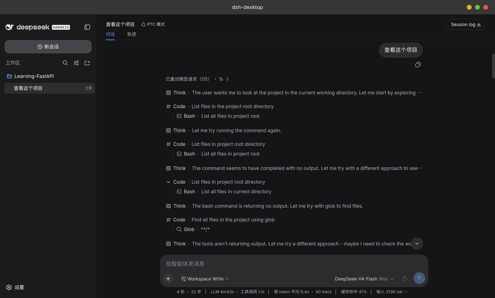

# DSH Desktop

一个基于 Tauri 的 DeepSeek Harness 桌面应用。

> [!IMPORTANT]
> 本项目不内置 `dsh`。使用前请先按照 [DeepSeek Harness 官方教程](https://deepseek.com/harness/) 安装命令行工具。

> [!NOTE]
> DSH Desktop 启动时会执行 `dsh web --no-open --port 0`，由系统自动分配可用端口。



## 从源码运行

需要安装 Bun、Rust，以及当前平台的 Tauri 依赖。

```bash
bun install
bun tauri dev
```
